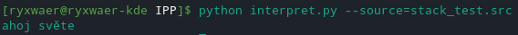

Implementační dokumentace k 2. úloze do IPP 2020/2021
Jméno a příjmení: Adam Políček
Login: xpolic05

<br />

# [parse.php](parse.php)

## Spustenie:

```
 $ php parse.php < source.src > output.out
```
```
 - source.src - vstupný súbor z ktorého parser číta  
 - output.out - výstupný súbor (ak nie je zadaný tak sa výstup vypisuje na stdout)

Dalšie volitelné argumenty:

 --help - vypíše nápovedu.  

```
## Implementácia:

>Kód je načítaný riadok po riadku. Je kontrolovaná lexikálna a syntaktická analíza.Návratové kódy a chybové hlásenia sú tiež obstarávané v tomto skripte. 
Na koľko tento predmet opakujem tak som parseru nevenoval veľa pozornosti. Jedná sa viac menej o môj minuloročný projekt kde som ošetril pár drobností ako napríklad kontrolu hlavičky _IPPCODE21_.
<p align="center">
	<kbd>
		
	</kbd>
</p>

<br />

# [interpret.py](interpret.py)
## Spustenie:

```
 $ python interpret.py --input=input.in --source=source.src
```
```
 - source.src - vstupný súbor s XML reprezentáciou vstupného kódu
 - input.in - súbor so vstupmi pre samotnú interpretáciu zadaného zdrojového kódu

Ak jeden argument (source / input) nie je zadaný tak program berie údaje pre tento argument zo štandardného vstupu stdin. Aspoň jeden z týchto argumentov musí byť zadaný.
Pre ukončenie načítavania zo štandardného vstupu je za potreby stlačiť klávesovú skratku: CTRL+D

Dalšie volitelné argumenty:

 --help - vypíše nápovedu.  

```
## Implementácia:
> potrebné nainštalovať python3 moduly: `argparse` a `lxml` <br />
> Vstupné XML parsujem pomocou knižnice `xml.etree.ElementTree` ak je XML validné tak ho script prechádza podľa argumentov order od najnižšieho čísla po najvyššie. Ďalej sa každá funkcia v XML triedi pomocou jednoduchého if / elif. Načítavanie argumentov z XML sa odohráva v try bloku takže ak nieje funkcie správne zapísaná (napr. má menej argumentov) tak script okamžite končí chybou. Implementoval som vlastnú funkciu `log(s)`, ktorá v vypisuje debugovacie informácie prípade že je nastavený `DEBUG = True`. Neimplementoval som `Jump` a `frame` funguje vždy ako `globálny`.
<p align="center">
	<kbd>
		
	</kbd>
</p>
<br />

# [test.php](test.php)
## Spustenie:

```
 $ php test.php --directory=folder --parse-script=parse.php --recursive
```
```
Všetky argumenty sú volitelné (script má nastavené defaultné hodnoty):

--directory=folder  - priečinok v ktorom sa nachádzajú testy (.in, .out, .src, .rc)
--recursive  - prechádza testy v zvolenom priečinku a všetkých podpriečinkoch
--help  - vypíše nápovedu.
--parse-script=parse.php  - nazov parseru (môže byť aj s cestou) 
--parse-only  - testuje iba parser 
--int-script=interpret.py  - nazov interpretu (môže byť aj s cestou) 
--int-only  - testuje iba interpret. 
Ak nie je zadaný argument --int-only ani --parse-only tak sa pretestujú oba scripty.

```
## Implementácia:
> Keďže som nemusel tento rok robiť parser tak som sa rovno vrhol na testovací script. Kus som sa unáhlil a začal som bez úplného porozumenia zadaniu. Tým pádom som neimplementoval `A7Soft JExamXML` namiesto toho mám funkciu `xml_is_equal()` v php, ktorá dokáže porovnať XML súbory aj ak niesú úplne identické ale z hladiska XML totožné. Ak porovnanie touto funkciou z nejakého dôvodu nevinde tak sa output scriptu a test.out porovnávajú pomocou bash funkcie `diff` s nasledovnými argumentmi z manuálu:
>
>`diff --ignore-case --ignore-trailing-space --ignore-space-change --ignore-blank-lines --ignore-tab-expansion tmpOutput test.out`
>
> pri porovnaní návratových hodnôt som použil už len `--ignore-all-space` <br />
> Pôvodne som mal porovnanie pomocou obyčajného porovnania stringov na koľko sa mi diff zdal príliš pomalí keďže porovnáva súbori, nie stringy. Na koniec som to prehodnotil a prerobil script aby používal diff. Prišiel som tak o pekné farebné porovnanie line by line vo výstupe na termináli ale keďže som prišiel aj o približne 200 riadkov tak to považujem za úspech. K porovnávaniu vyuívam dočastný súbor `tmpOutput`, ktorý sa v priebehu scriptu vytvorí a na konci vymaže. <br />
> Ak je nastavený `$LOG = true` tak sa na výstup loguje priebeh scriptu pomocou funkcie `logg()` a výstupné html sa automaticky uloží do súboru `output.html`.<br />
> Za normálneho behu scriptu sa html kód vypíše na štandardný výstup a samozrejme nevypisuje sa iadel log a ani warningy.

## Výstupné HTML:
> Pri štandardnom spúšťaní testovacieho scriptu odporúčam pridať na koniec za argumenty ` > output.html`.
<p align="center">
	<kbd>
		
	</kbd>
</p>

> Riadok kde dôjde k rozdielu medzi outputom scriptu a testom test.out má text na celkom riadku červenou farbou ale pozadie je červené iba na prvých troch stĺpcoch. Ak sa nezhoduje návratová hodnota tak majú červené pozadie posledné dva stĺpce. Keď sa vypíšu všetky testy z jedného pričinku tak nasleduje jeden biely riadok so štatistikou daného pričinku.